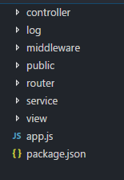

# koa2-learn

## 环境准备：安装node.js，建议版本号`>=7.6`，否则需额外安装插件。
<br>

  - 直接安装 node.js ：node.js官网地址 [https://nodejs.org](https://nodejs.org)
  - nvm管理多版本 node.js ：可以用nvm 进行node版本进行管理
      - Mac 系统安装 nvm [https://github.com/creationix/nvm#manual-install](https://github.com/creationix/nvm#manual-install)
      - windows 系统安装 nvm [https://github.com/coreybutler/nvm-windows](https://github.com/coreybutler/nvm-windows)
      - Ubuntu 系统安装 nvm [https://github.com/creationix/nvm](https://github.com/creationix/nvm)

<br>

* 新建项目，使用`npm init`初始化，目录如下
```txt
├── app.js
├── package.json
```
* 安装 koa，并将版本信息保存在 package.json 中
```js
cnpm i koa -S
```
## 一、认识middleware中间件
在HelloWorld的demo中，代码如下

```js
const Koa = require('koa');
const app = new Koa();

app.use(async (ctx,next) => {
  await next()
  ctx.body = 'Hello World';
});

app.listen(3000);
``` 
它的作用是：每收到一个 `http` 请求，`Koa` 都会调用通过 `app.use()` 注册的 `async` 函数，同时为该函数传入 `ctx` 和 `next` 两个参数，最后给页面返回一个`Hello World'.
<br>

上述代码中，由 `async` 标记的函数称为『异步函数』，在异步函数中，可以用 `await` 调用另一个异步函数，`async` 和 `await` 这两个关键字将在 ES7 中引入。参数 `ctx` 是由 `koa` 传入的，我们可以通过它来访问 `request` 和 `response`，`next` 是 `koa` 传入的将要处理的下一个异步函数。
**这里的 `async` 函数就是我们所说的中间件，正是因为中间件的扩展性才使得 `Koa` 的代码简单灵活。**

<br>
下面我们简单介绍一下传入中间件的两个参数。

* ctx : `ctx` 作为上下文使用，包含了基本的 `ctx.request` 和 `ctx.response`。另外，还对 `Koa` 内部一些常用的属性或者方法做了代理操作，使得我们可以直接通过 `ctx` 获取。比如，`ctx.request.url` 可以写成 `ctx.url`。  --  除此之外，`Koa` 还约定了一个中间件的存储空间 `ctx.state`。通过 `state` 可以存储一些数据，比如用户数据，版本信息等。如果你使用 `webpack` 打包的话，可以使用中间件，将加载资源的方法作为 `ctx.state` 的属性传入到 `view` 层，方便获取资源路径。

* next : `next` 参数的作用是将处理的控制权转交给下一个中间件，而 `next()` 后面的代码，将会在下一个中间件及后面的中间件（如果有的话）执行结束后再执行。

**所以： 中间件的顺序很重要！**
```js
// 按照官方示例
const Koa = require('koa')
const app = new Koa()

// 记录执行的时间
app.use(async (ctx, next) => {
  let stime = new Date().getTime()
  await next()
  let etime = new Date().getTime()
  ctx.response.type = 'text/html'
  ctx.response.body = '<h1>Hello World</h1>'
  console.log(`请求地址: ${ctx.path}，响应时间：${etime - stime}ms`)
});

app.use(async (ctx, next) => {
  console.log('中间件1 doSoming')
  await next();
  console.log('中间件1 end')
})

app.use(async (ctx, next) => {
  console.log('中间件2 doSoming')
  await next();
  console.log('中间件2 end')
})

app.use(async (ctx, next) => {
  console.log('中间件3 doSoming')
  await next();
  console.log('中间件3 end')
})

app.listen(3000, () => {
  console.log('server is running at http://localhost:3000')
})
``` 
运行起来后，控制台显示： 

```txt
server is running at http://localhost:3000
``` 

<br> 

然后打开浏览器，访问 `http://localhost:3000`，控制台显示内容更新为： 

```txt
server is running at http://localhost:3000
中间件1 doSoming
中间件2 doSoming
中间件3 doSoming
中间件3 end
中间件2 end
中间件1 end
请求地址: /，响应时间：2ms
```
从结果上可以看到，流程是一层层的打开，然后一层层的闭合，像是剥洋葱一样 —— 洋葱模型。

此外，如果一个中间件没有调用 `await next()`，会怎样呢？答案是『后面的中间件将不会执行』。 如果`await next()`后面没有中间件了，那么也将结束执行。

## 二、路由koa-router
路由是用于描述 `URL` 与处理函数之间的对应关系的。比如用户访问 `http://localhost:3000/`，那么浏览器就会显示 `index` 页面的内容，如果用户访问的是 `http://localhost:3000/home`，那么浏览器应该显示 `home` 页面的内容。

要实现上述功能，如果不借助 `koa-router` 或者其他路由中间件，而是自己去处理路由，那么写法可能如下所示：

```js
const Koa = require('koa');
const app = new Koa();

app.use(async (ctx, next) => {
    if (ctx.request.path === '/') {
        ctx.response.body = '<h1>index page</h1>';
    } else {
        await next();
    }
});
app.use(async (ctx, next) => {
    if (ctx.request.path === '/home') {
        ctx.response.body = '<h1>home page</h1>';
    } else {
        await next();
    }
});
app.use(async (ctx, next) => {
    if (ctx.request.path === '/404') {
        ctx.response.body = '<h1>404 Not Found</h1>';
    } else {
        await next();
    }
});

app.listen(3000, ()=>{
  console.log('server is running at http://localhost:3000')
})
```
这样的写法能够处理简单的应用，但是，一旦要处理的 `URL` 多起来的话就会显得特别笨重。所以我们可以借助 `koa-router` 来更简单的实现这一功能。
下面来介绍一下如何正确的使用 `koa-router`。
* 安装 koa-router
```js
cnpm i koa-router -S
```
* 基本使用方法

如果要在 `app1.js` 中使用 `koa-router` 来处理 `URL`，可以通过以下代码来实现：

```js
const Koa = require('koa')
// 注意 require('koa-router') 返回的是函数:
const router = require('koa-router')()
const app = new Koa()

 // 添加路由
 router.get('/', async (ctx, next) => {
    ctx.response.body = `<h1>index page</h1>`
})

router.get('/home', async (ctx, next) => {
    ctx.response.body = '<h1>HOME page</h1>'
})

router.get('/404', async (ctx, next) => {
    ctx.response.body = '<h1>404 Not Found</h1>'
})

 // 调用路由中间件
 app.use(router.routes())

app.listen(3000, ()=>{
  console.log('server is running at http://localhost:3000')
})
```
通过上面的例子，我们可以看到和之前不使用 `koa-router` 的显示效果是一样的。不过使用了 `koa-router` 之后，代码稍微简化了一些，而且少了 `if` 判断，还有省略了 `await next()`（因为没有其他中间件需要执行，所以这里就先省略了）。

当然，除了 `GET` 方法，`koa-router` 也支持处理其他的请求方法，比如：

```js
//支持这种链式写法
router
  .get('/', async (ctx, next) => {
    ctx.body = 'Hello World!';
  })
  .post('/users', async (ctx, next) => {
    // ... 
  })
  .put('/users/:id', async (ctx, next) => {
    // ... 
  })
  .del('/users/:id', async (ctx, next) => {
    // ... 
  })
  .all('/users/:id', async (ctx, next) => {
    // ... 
  });
```
上述代码中有一个`all` 方法。`all` 方法用于处理上述方法无法匹配的情况，或者你不确定客户端发送的请求方法类型。比如有一个`GET`请求，优先匹配和`router.get`方法中`url`规则一样的请求，如果匹配不到的话就匹配`router.all`方法中`url`规则一样的请求。
当请求都无法匹配的时候，我们可以跳转到自定义的 `404` 页面，比如：

```js
//这个放在路由的最后
router.all('/*', async (ctx, next) => {
  ctx.response.status = 404;
  ctx.response.body = '<h1>404 Not Found</h1>';
});
```
`*` 号是一种通配符，表示匹配任意 `URL`。这里的返回是一种简化的写法，真实开发中，我们肯定要去读取 `HTML` 文件或者其他模板文件的内容，再响应请求。关于这部分的内容后面的章节中会详细介绍。
### 其他特性
* 命名路由：在开发过程中我们能够根据路由名称和参数很方便的生成路由 `URL`：

```js
router.get('user', '/users/:id', async (ctx, next)=>{
  // ... 
});

router.url('user', 3);
// => 生成路由 "/users/3" 
 
router.url('user', { id: 3 });
// => 生成路由 "/users/3" 
 
router.use(async (ctx, next) {
  // 重定向到路由名称为 “sign-in” 的页面 
  ctx.redirect(ctx.router.url('sign-in'));
})
```
`router.url` 方法方便我们在代码中根据路由名称和参数(可选)去生成具体的 `URL`，而不用采用字符串拼接的方式去生成 `URL` 了。

* 多中间件：`koa-router` 也支持单个路由多中间件的处理。通过这个特性，我们能够为一个路由添加特殊的中间件处理。也可以把一个路由要做的事情拆分成多个步骤去实现，当路由处理函数中有异步操作时，这种写法的可读性和可维护性更高。比如下面的示例代码所示：

```js
router.get(
    '/users/:id',
    async (ctx, next) => {
        ctx.body=`<h1>user:${ctx.params.id}</h1>`;
        ctx.user='xiaoming';
        next();
    },
    async (ctx, next) => {
        console.log(ctx.user);
        // 在这个中间件中再对用户信息做一些处理
        // => { id: 17, name: "Alex" }
    }
);
```

* 嵌套路由：我们可以在应用中定义多个路由，然后把这些路由组合起来用，这样便于我们管理多个路由，也简化了路由的写法。
```js
const Router=require('koa-router')

const forums = new Router();
const posts = new Router();
 
posts.get('/', async (ctx, next)=>{
    ctx.body=`fid:${ctx.params.fid}`
});
posts.get('/:pid', async (ctx, next)=>{
    ctx.body=`pid:${ctx.params.pid}`
});
forums.use('/forums/:fid/posts', posts.routes(), posts.allowedMethods());
 
// 可以匹配到的路由为 "/forums/123/posts" 或者 "/forums/123/posts/123"
app.use(forums.routes());
```
* 路由前缀：通过 `prefix` 这个参数，我们可以为一组路由添加统一的前缀，和嵌套路由类似，也方便我们管理路由和简化路由的写法。不同的是，前缀是一个固定的字符串，不能添加动态参数。

```js
const Router=require('koa-router')
const router = new Router({
  prefix: '/users'
});
 
router.get('/', ...); // 匹配路由 "/users" 
router.get('/:id', ...); // 匹配路由 "/users/:id" 
```
一般在更新版本号的时候很方便。
* URL 参数：`koa-router` 也支持参数，参数会被添加到 `ctx.params` 中。参数也可以是一个正则表达式，这个功能的实现是通过 `path-to-regexp` 来实现的。原理是把 `URL` 字符串转化成正则对象，然后再进行正则匹配，之前的例子中的 `*` 通配符就是一种正则表达式。

```js
router.get('/:category/:title', function (ctx, next) {
  console.log(ctx.params);
  // => { category: 'programming', title: 'how-to-node' } 
});
```
## 三、解析请求参数
当我们捕获到请求后，一般都需要把请求传递过来的数据解析出来。数据传递过来的方式一般有三种：
* get请求，请求参数为`URL`路径后面以`?`开头的查询参数：如`http://localhost:3000/home?id=1&name=hfimy`。使用`ctx.request.query`或`ctx.request.querystring`可以获取到查询参数。不同的是`query`返回的是对象，`querystring`返回的是字符串。
```
  router.get('/home', async(ctx, next) => {
    console.log('query:',ctx.request.query)
    console.log('querystring:',ctx.request.querystring)
    ctx.response.body = '<h1>HOME page</h1>'
  })
```
访问`http://localhost:3000/home?id=1&name=hfimy`，控制台输出如下
```
query: {id:'1',name:'hfimy'}
querystring: id=1&name=hfimy
```
* get请求，请求参数放在`URL`路径里面，如`http://localhost:3000/home/1/hfimy`。这种情况下，`koa-router`会把请求参数解析在`params`对象上，通过`ctx.params`可以获取到这个对象。
```
  router.get('/home/:id/:name', async(ctx, next) => {
    console.log(ctx.params)
    ctx.response.body = '<h1>HOME page</h1>'
  })
```
访问`http://localhost:3000/home/1/hfimy`，控制台输出如下
```
{id:'1',name:'hfimy'}
```
* post请求，请求参数放在`body`里面。当用 `post` 方式请求时，我们会遇到一个问题：`post` 请求通常都会通过表单或 `JSON` 形式发送，而无论是 `Node` 还是 `Koa`，都 **没有提供** 解析 `post` 请求参数的功能。这里，我们将引入一个`koa-bodyparser`包，安装完成之后，我们需要在 `app.js` 中引入中间件并应用： 
```
  const Koa = require('koa')
  const router = require('koa-router')()
  const bodyParser = require('koa-bodyparser')
  const app = new Koa()

  app.use(bodyParser())
```
不管是通过表单提交还是以`JSON`形式发送，我们都可以通过`ctx.request.body`获取到提交的数据。
## 四、指定静态资源目录
这里介绍一个在`koa`中提供静态资源访问的第三方中间件：`koa-static`，用法与express中的`express-static`基本一致，指定静态文件目录即可。一般在app.js同级目录下创建一个`public`目录，用来存放静态文件。
```
...
const static = require('koa-static')
...
//注意，提供静态资源访问的中间件需要放在路由中间件的前面使用
app.use(static(path.resolve(__dirname, "./public")))
```
## 五、常用中间件
#### 1. 返回json格式的数据 
如果需要响应返回json数据，我们只需要设置响应数据类型为`json`格式，并把json数据挂载在响应体`body`上即可实现返回`json`数据。
```
ctx.set("Content-Type", "application/json")
ctx.body = JSON.stringify(jsonData)
```
但是这样每次返回响应都需要写重复的代码，我们再次引入一个`koa-json`中间件，它会自动将我们返回的数据转换为`json`格式。
```
const Koa = require('koa');
const json = require('koa-json');
const app = new Koa();

app.use(json());

app.use((ctx) => {
  ctx.body = { name: 'hfimy',age:23 };
});
```
```
$ GET /

{
  "name": "ht",
  "age": 23
}
```
#### 2. 记录日志
`log4js` 是 Node.js 中一个成熟的记录日志的第三方模块。<br>
* 日志分类 :日志可以大体上分为访问日志和应用日志。访问日志一般记录客户端对项目的访问，主要是 `http` 请求。这些数据属于运营数据，也可以反过来帮助改进和提升网站的性能和用户体验；应用日志是项目中需要特殊标记和记录的位置打印的日志，包括出现异常的情况，方便开发人员查询项目的运行状态和定位 `bug` 。应用日志包含了`debug`、`info`、`warn` 和 `error`等级别的日志。 

* 日志等级：`log4js` 中的日志输出可分为如下7个等级：<br>
  `ALL、TRACE、DEBUG、INFO、WARN、ERROR、FATAL、MARK、OFF`<br>
  `ALL`：输出所有的日志 <br>
  `OFF`：所有日志都不输出<br>
  其它：输出级别相等或者高级别的日志。<br>

在应用中按照级别记录了日志之后，可以按照指定级别输出高于指定级别的日志。 

`log4js` 官方简单示例
```js
const log4js = require('log4js');
const logger = log4js.getLogger();
logger.level = 'debug';
logger.debug("Some debug messages");
```
运行该代码，可以在终端看到如下输出：
```
[2017-12-24T16:45:45.101] [DEBUG] default - Some debug messages
```
一段带有日期、时间、日志级别和调用 debug 方法时传入的字符串的文本日志。实现了简单的终端日志输出。

`log4js` 官方复杂示例
```js
const log4js = require('log4js');
log4js.configure({
  appenders: { cheese: { type: 'file', filename: 'cheese.log' } },
  categories: { default: { appenders: ['cheese'], level: 'error' } }
});
const logger = log4js.getLogger('cheese');
logger.trace('Entering cheese testing');
logger.debug('Got cheese.');
logger.info('Cheese is Gouda.');
logger.warn('Cheese is quite smelly.');
logger.error('Cheese is too ripe!');
logger.fatal('Cheese was breeding ground for listeria.');
``` 
再次运行，在当前目录下会生成一个日志文件`cheese.log`文件，文件中有两条日志并记录了`error`及以上级别的信息，如下
```
[2017-12-24T17:03:42.761] [ERROR] cheese - Cheese is too ripe!
[2017-12-24T17:03:42.761] [FATAL] cheese - Cheese was breeding ground for listeria.
```
我们可以通过自定义实现日志中间件，把`logger`对象挂载到`ctx`上下文中，从而在应用的其它地方都可以输出日志。<br>
日志切割：当我们的项目在线上环境稳定运行后，访问量会越来越大，日志文件也会越来越大。日益增大的文件对查看和跟踪问题带来了诸多不便，同时增大了服务器的压力。虽然可以按照类型将日志分为两个文件，但并不会有太大的改善。所以我们按照日期将日志文件进行分割。比如：今天将日志输出到 task-2017-12-24.log 文件，明天会输出到 task-2017-12-25.log 文件。减小单个文件的大小不仅方便开发人员按照日期排查问题，还方便对日志文件进行迁移。因此，我们修改日志类型为日期文件，按照日期切割日志输出，以减小单个日志文件的大小。如下，修改代码：
```
log4js.configure({
    appenders: {
        cheese: {
            type: 'dateFile', // 日志类型 
            filename: `log/task`,  // 输出的文件名
            pattern: '-yyyy-MM-dd.log',  // 文件名增加后缀
            alwaysIncludePattern: true   // 是否总是有后缀名
        }
    },
    categories: { default: { appenders: ['cheese'], level: 'error' } }
});
```
这样，在当前目录下会生成一个`log`目录，并生成一个`task-2017-12-24.log`日志文件。<br>

除了`log4js`以外，还有十分简洁的`koa-logger`日志中间件，直接在控制台中输出
```
const logger = require('koa-logger')
const Koa = require('koa')
 
const app = new Koa()
app.use(logger())
```
#### 3. 错误处理
错误处理是应用健壮性非常重要的一部分。koa 里面提供了 `error` 事件，当发生错误时，可以通过监听该事件，对错误进行统一的处理。
```
const koa = require('koa');
const app = koa();
//当发生错误的时候可以将错误信息写入日志
app.on('error', (err,ctx)=>{
    if (process.env.NODE_ENV != 'test') {
        console.log(err.message);
        console.log(err);
        //ctx.logger.error(err)
    }
});   

```
这里我们引入一个`koa-onerror`中间件，优化错误处理信息。
```
const fs = require('fs');
const koa = require('koa');
const onerror = require('koa-onerror');
 
const app = new koa();
 
onerror(app);
 
app.use(ctx => {
  // foo();
  ctx.body = fs.createReadStream('not exist');
});
```

#### 4. 视图view
可以根据选择的模板引擎来定义视图。下面简单介绍如何引入模板引擎
* 使用ejs模板引擎：`koa-ejs`
```
const Koa = require('koa');
const render = require('koa-ejs');
const path = require('path');
 
const app = new Koa();
render(app, {
  root: path.join(__dirname, 'view'),
  layout: 'template',
  viewExt: 'html',
  cache: false,
  debug: true
});
 
app.use(async function (ctx) {
  await ctx.render('user');
});
 
app.listen(7001);
```
* 使用xtemplate模板引擎：`koa-xtpl`
```
const path = require('path')
const Koa = require('koa')
const xtpl = require('koa-xtpl')
const app = new Koa()
 
// root 
app.use(xtpl(path.join(__dirname, 'views')))
// or options 
app.use(xtpl({
  root: path.join(__dirname, 'views'),
  extname: 'xtpl',
  commands: {}
}))
 
app.use(async ctx => {
  await ctx.render('demo', { title: new Date() })
})
 
app.listen(3000)
```
* `kow-views`：可以自定义使用不同的模板
```
var views = require('koa-views');
 
// Must be used before any router is used
app.use(views(__dirname + '/views', {
  map: {
    html: 'underscore'
  }
}));
 
app.use(async function (ctx, next) {
  ctx.state = {
    session: this.session,
    title: 'app'
  };
 
  await ctx.render('user', {
    user: 'John'
  });
});
```
## 六、代码目录结构
在真正的应用开发中，我们不可能将所有代码都写在`app.js`中，一般会将代码进行分层。<br>
#### 1. 分离路由
我们将所有的`router`抽离出来，在`app.js`同级目录创建一个`router`目录，并在`index.js`文件中暴露接口，这样可以进一步将对应的路由处理逻辑放在不同的文件里。然后只需要在`app.js`中引入路由主文件，将`app`传入即可
```
// app.js 
const router=require('./router/index')
...
router(app)
```
```
// router/index.js
const router = require('koa-router')()
module.export=(app)=>{
  router.get('/',async (ctx,next)=>{
    ...
    await next();
    ...
  })
  ...
  app.use(router.routes(),router.allowedMethods())

}
```
#### 2. 分离`controller`层，新增一个`controller`文件夹，将`router`对应路由的业务处理逻辑提取出来，如下
```
// controller/home.js
module.export={
  index:async (ctx,next)=>{
    ...
  },
  home:async (ctx,next)=>{
    ctx.body='<h1>Home Page</h1>'
  }
}
```
```
// router/index.js
const router = require('koa-router')()
const HomeController = require('../controller/home')
module.export=(app)=>{
  router.get('/',HomeController.home)
  ...
  app.use(router.routes(),router.allowedMethods())

}
```
目前的代码结构目录已经比较清晰了，适用于以 node 作为中间层的项目。如果想要把 node 作为真正的后端去操作数据库等，建议再分出一层 service，用于处理数据层面的交互，比如调用 model 处理数据库，调用第三方接口等，而controller 里面只做一些简单的参数处理。<br>

#### 3. 分离中间件
此外，随着项目的增大，中间件的数量也越来越多，建议可以把所有的中间件抽出来放在一个`middleware`文件夹下，不管是第三方中间件，还是自定义的中间件，统一放在此处处理。
#### 4. view
提供视图，根据选择的模板引擎定义视图，可以通过`render`渲染后作为响应主体返回给前端，也可以定义一些错误页面如404等。
#### 5. public静态文件目录以及log日志文件目录。
最终的应用结构如下：




## 七、运行部署
* 运行：采用 nodemon 来代替 node 以启动应用。当代码发生变化时候，nodemon 会帮我们自动重启。
```
cnpm i nodemon -g
...
nodemon app.js
```
* 部署：使用 pm2，pm2 是一个带有负载均衡功能的Node应用的进程管理器。
```
cnpm i pm2 -g
...
pm2 start app.js
```